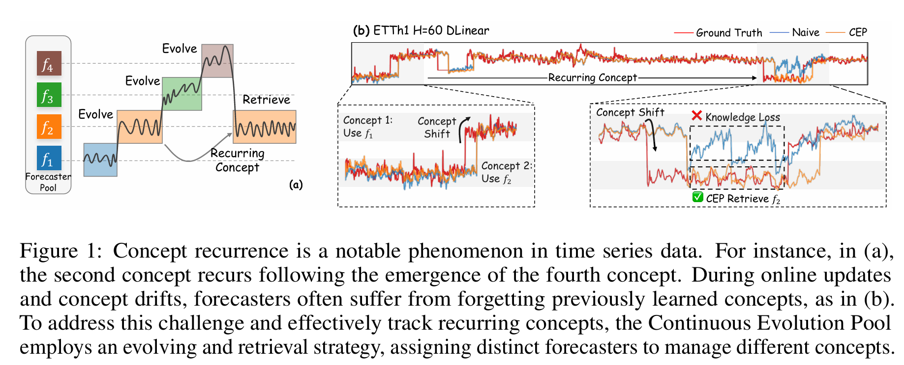
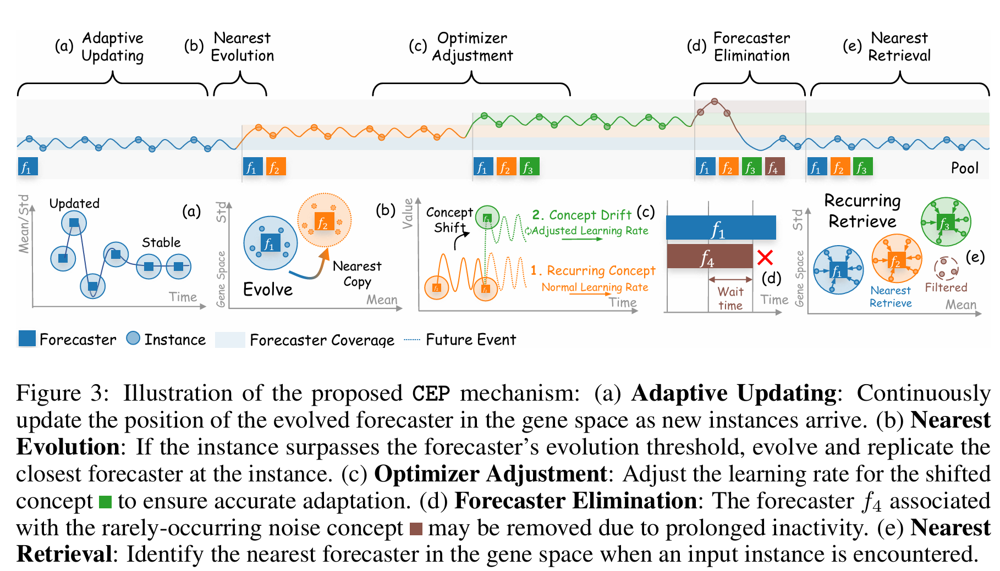
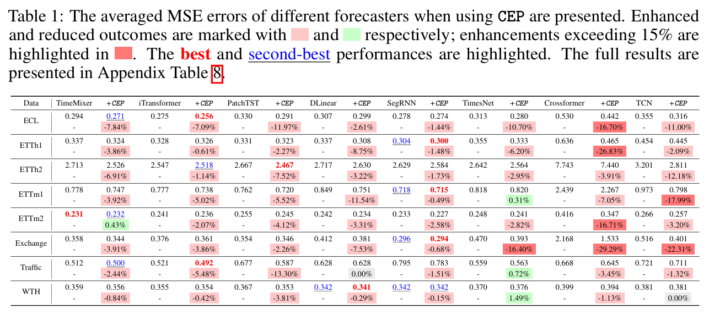
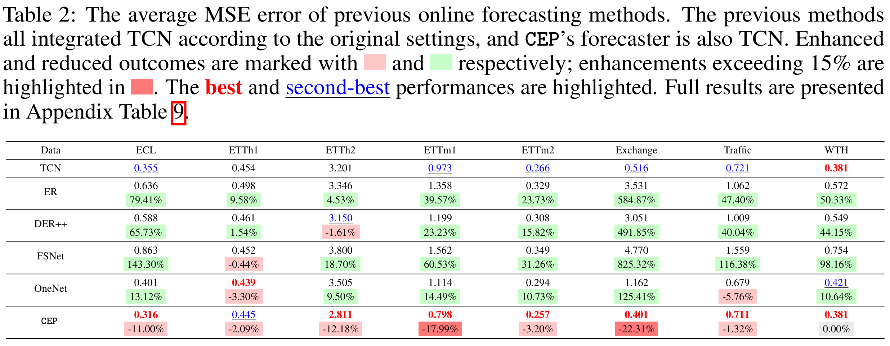
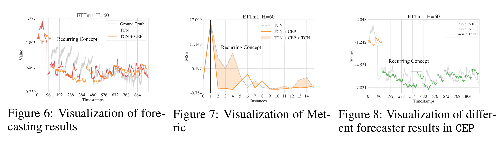

<div align="center">
  <h2><b> Continuous Evolution Pool: Taming Recurring Concept Drift
    <br/> in Online Time Series Forecasting </b></h2>
</div>

**Repo Status:**

[](https://arxiv.org/abs/2506.14790)

[](https://github.com/ztxtech/cep_ts)
[](https://github.com/ztxtech/cep_ts/activity?ref=master&activity_type=direct_push)
[](https://github.com/ztxtech/cep_ts/graphs/commit-activity)
[](https://github.com/ztxtech/cep_ts)
[](https://github.com/ztxtech/cep_ts)
[](https://github.com/ztxtech/cep_ts)
[](https://github.com/ztxtech/cep_ts)


## Introduction

Accurate time series forecasting is a fundamental task in various fields such as finance, energy management, traffic prediction, and environmental monitoring. However, online time series forecasting often faces a significant challenge known as concept drift, especially recurring concept drift. Recurring concept drift refers to the periodic reappearance of certain data patterns after a period of absence. Existing solutions mainly rely on parameter updating techniques, which may lead to the loss of previously learned knowledge and lack effective knowledge retention mechanisms.



## The Continuous Evolution Pool (CEP)

To address these limitations, we propose the Continuous Evolution Pool (CEP), a novel pooling mechanism designed to store multiple forecasters corresponding to different concepts. When a new test sample arrives, CEP selects the nearest forecaster in the pool for prediction and learns from the features of its neighboring samples. If there are insufficient neighboring samples, it indicates the emergence of a new concept, and a new model will be added to the pool. Additionally, CEP employs an elimination mechanism to remove outdated knowledge and filter noisy data.



## Main Contributions

1. We identify recurring concept drift as a significant challenge in online time series forecasting and point out the shortcomings of existing methods.
2. We propose the CEP mechanism, which effectively mitigates knowledge loss and enables the model to leverage previously acquired knowledge more effectively.
3. Through extensive experiments on multiple real - world datasets and various neural network architectures, we demonstrate that CEP substantially enhances prediction accuracy in scenarios characterized by recurring concept drift.

## Main Results

### Comparison with Naive Forecasting Models

The experiment results in following table show that the proposed CEP generally reduces the Mean Squared Error (MSE) in forecasting across various datasets and model architectures. This indicates that CEP can effectively capture and utilize features of different concepts, enhancing the performance of online time series forecasting in scenarios with recurring concept drift. Its effectiveness is not limited to a single architecture or dataset, demonstrating broad applicability. Notably, the Crossformer model experiences a significant improvement in univariate online forecasting, with an MSE reduction exceeding 25%. This is due to Crossformer's design that leverages both time and variable dimensions. In contrast, models like PatchTST, which rely solely on the time dimension, may struggle to adapt to complex concept drifts. However, in rare cases, CEP may not achieve the expected improvements, possibly because a single set of hyperparameters was used for all experiments, which may not be optimal for every dataset.



### Comparison with Online Forecasting Models

Results in following table reveal that ER, DER++, FSNet, and OneNet did not perform well in delayed scenarios. Experience replay methods reuse instances from memory to update the model, but limited memory capacity may cause them to lose earlier concepts due to concept drift. FSNet is prone to forecasting biases due to delayed sample arrival, while OneNet adjusts model parameters using short - term information to optimize forecasts in delayed scenarios to some extent. To comprehensively preserve knowledge of different concepts, CEP uses a pooling mechanism to assign different concepts to distinct models. In delay - feedback scenarios, CEP significantly outperforms previous time series methods, reducing the MSE by over 20%. This suggests that previous online methods are less effective in delay scenarios with recurring concepts and may even be inferior to the naive model.



### Visualization Comparison

Figure 6 shows the forecasting results of the naive model and CEP. After the concept recurred (instance 2 - 14), CEP's MSE remained stable in Figure 7, while the naive model's MSE rose significantly. Figure 8 visualizes CEP's operation, with forecasts of different concepts marked by distinct colors, demonstrating CEP's ability to quickly and accurately identify concepts.


## Installation

1. Clone the repository:
2. Install the required dependencies:

```bash
pip install -r requirements.txt
```

## Usage

### Extract the Dataset

```bash
unzip ./data/data.zip -d ./data/
```

### Manually Running Experiments

1. Run the main script:

```bash
python main.py --some_parameter XXX
```

### Running Experiments with Configurations

1. Run the main script with a configuration file:

```bash
python main.py --config ./configs/main/ep_cep_da_ECL_ml_CEP_fr_Crossformer_pn_1_fo_0.8_do_1.5_oe_fade_pt_True.json
```

### Reproducing Experiments from the Paper

1. Main Experiment: Run the script in `./run_scripts`:

```bash
python run_scripts/cep.py
```

2. Ablation Study: To verify CEP components effectiveness:

```bash
python run_scripts/ablation.py
```

3. Baseline Comparison: Reproduce baseline methods results:

```bash
python run_scripts/baseline.py
```

4. Parameter Sensitivity: Test key parameters' impacts:

```bash
python run_scripts/parameter_sensitivity.py
```

## Repository Structure

- `configs`: Contains configuration files for different experiments.
- `data`: Includes data loading scripts and datasets.
- `exp`: Contains experiment scripts.
- `layers`: Contains neural network layer implementations.
- `models`: Contains different model implementations.
- `utils`: Contains utility functions.

## Citation

If you find this repo useful, please cite our paper.

```
@misc{zhan2025continuousevolutionpooltaming,
      title={Continuous Evolution Pool: Taming Recurring Concept Drift in Online Time Series Forecasting}, 
      author={Tianxiang Zhan and Ming Jin and Yuanpeng He and Yuxuan Liang and Yong Deng and Shirui Pan},
      year={2025},
      eprint={2506.14790},
      archivePrefix={arXiv},
      primaryClass={cs.LG},
      url={https://arxiv.org/abs/2506.14790}, 
}
```

## License

This source code is released under the MIT license, included [here](LICENSE).

## Acknowledgement

This library is constructed based on the following repos:

- [**FSNet** https://github.com/salesforce/fsnet/](https://github.com/salesforce/fsnet/).
- [**OneNet**: https://github.com/yfzhang114/OneNet/](https://github.com/yfzhang114/OneNet/).
- [**Time Series Library**: https://github.com/thuml/Time-Series-Library/](https://github.com/thuml/Time-Series-Library/).

## Star History

[](https://star-history.com/#ztxtech/cep_ts&Date)
